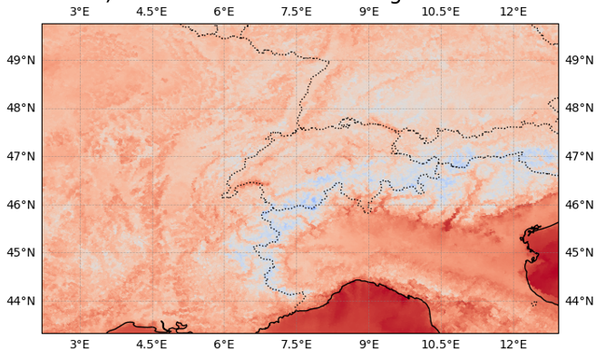

Numerical Weather Model Prediction Data
=========================================

From grib files
----------------
The GribRetriever is designed for NPW outputs from a local filesystem in ``grib`` format. They can contain vertical levels and ensemble members, and can be either analysis or forecast data.

.. code-block:: python

    import numpy as np
    import pandas as pd
    from weathermart.default_provider import default_provider

    start = "2023-12-18 00:00"
    end = "2023-12-18 23:00"
    provider = default_provider()
    config = {
        "ICON-CH1-EPS": [
            "CLCT",
            "TOT_PREC",
            "U_10M",
            "V_10M",
            "T_2M",
            "TD_2M",
        ],
        "dates": pd.date_range(start, end),
    }
    provider.provide_from_config(
        config,
        datatype="forecast",
        step_hours=np.arange(0, 9),
        ensemble_members=0,
    )

