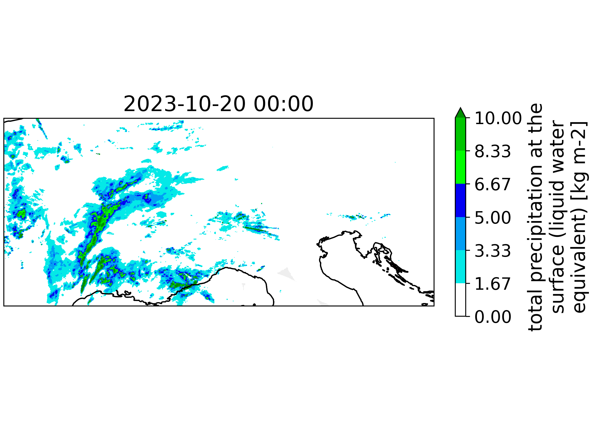

OPERA Radar
===========

You can also retrieve OPERA radar data from the MeteoFrance API.
This requires an API key, which you can obtain by registering on the MeteoFrance website.

.. code-block:: python

    from weathermart.retrievers.radar import OperaRetriever

    retriever = OperaRetriever()

    ds = retriever.retrieve("OPERA", "TOT_PREC", ["2024-01-01", "2024-01-02"])

