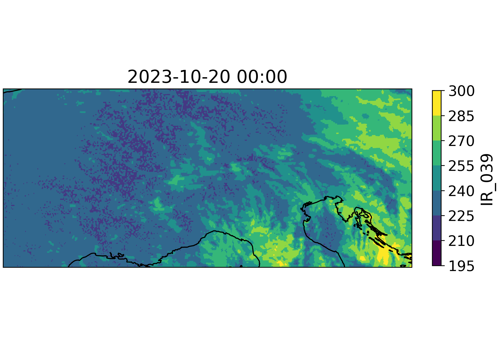

Satellite Data
==============

Eumetsat API
------------

You can retrieve data directly from the EUMetSat API using the ``EumetsatRetriever`` class.
This is generally the preferred way to access satellite data, since you get the data from a bigger domain.
You need to get an API key from EUMetSat to use this retriever, see https://api.eumetsat.int/api-key/ for instructions.

.. code-block:: python

    from weathermart.retrievers.satellite import EumetsatRetriever

    retriever = EumetsatRetriever()

    ds = retriever.retrieve(None, "IR_039", ["2024-01-01", "2024-01-02"])

