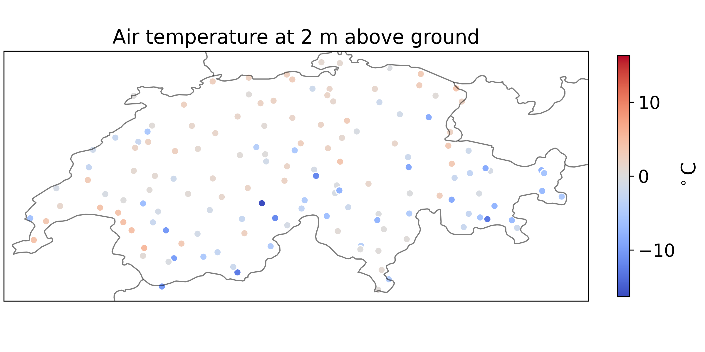

Station Data
============
Station data is retrieved through ``jretrieve`` API.
You need to have a valid jretrieve credentials file (warning: not an offline token) to access the data.
Contact the data provider team to get access to the credentials file.

We use use_limitation as main criteria for station selection.
Default value is 20, which contains the Swiss MetNet stations.
Maximum value is 40, which contains all stations one is allowed to access.
Values above 40 raise an Exception.

.. code-block:: python

    import pandas as pd

    from weathermart.default_provider import default_provider

    start = "2023-12-18 00:00"
    end = "2023-12-18 23:00"
    provider = default_provider()
    config = {
        "SURFACE": [
            "TOT_PREC",
            "U_10M",
            "V_10M",
            "T_2M",
            "TD_2M",
        ],
        "dates": pd.date_range(start, end),
    }
    provider.provide_from_config(config, use_limitation=30, jretrieve_credentials_path="<path_to_creds>")

